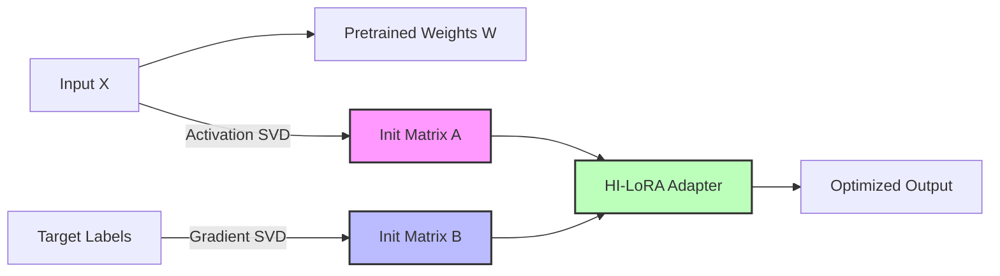

# HI-LoRA: Hybrid Initialization Low-Rank Adaptaion(Dual-SVD Initialization for Structurally Aligned Low-Rank Adaptation)

**Official Implementation — Supplementary Code for Undergraduate Thesis (2025)**  
**Author:** Dongha Lee, Chung-Ang University — Department of Electrical & Electronics Engineering  
**Keywords:** LoRA, Activation SVD, Gradient SVD, Parameter-Efficient Fine-Tuning, Information Preservation

---

## 📌 Abstract

**Low-Rank Adaptation (LoRA)** enables parameter-efficient fine-tuning, but its random initialization introduces structural information loss due to misalignment between low-rank update directions and pretrained model geometry. This work presents **HI-LoRA**, a Dual-SVD initialization method that aligns LoRA update matrices with **Activation-SVD** (input representation geometry) and **Gradient-SVD** (task-driven supervision geometry) simultaneously.

This approach mitigates early-stage loss collapse, accelerates convergence, and maintains inference efficiency while requiring **no additional parameters at inference time**.

## 🔎 Motivation

Standard LoRA initializes matrices $A$ and $B$ randomly, ignoring:
1. Representation geometry learned during pretraining
2. Task-dependent gradient directions
3. Rank-limited tangent space that discards useful variations

As a result, LoRA often suffers from:

| Problem | Effect |
| :--- | :--- |
| **Misaligned update space** | Slower convergence |
| **Random directions** | Unstable early loss |
| **Rank-limited tangent** | Early information collapse |

**HI-LoRA** provides structural alignment *before* training starts, addressing this bottleneck directly at initialization.

## 🔬 Research Background & Technical Motivation

Conventional Low-Rank Adaptation (LoRA) initializes its update matrices without reflecting either the representation geometry learned during pretraining or the task-specific supervision introduced during fine-tuning. As a result, early steps of optimization may explore directions misaligned with semantic boundaries, leading to unstable convergence and inefficient learning. 

Prior activation-based initialization methods stabilize training by capturing dominant feature subspaces, while gradient-based approaches incorporate task sensitivity — yet each remains inherently single-source and limited. **HI-LoRA addresses this by introducing Hybrid Dual-SVD Initialization**, aligning the LoRA update space with both input activation structure (Activation-SVD) and output supervision structure (Gradient-SVD). 

This hybrid alignment reduces early-stage information loss, improves convergence speed, and shows stronger performance on semantically sensitive tasks such as MRPC, without adding inference cost.

## 🧠 Method: Dual-SVD Alignment

We decompose the representation flow into two orthogonal information sources:

1.  **Activation → Matrix $A$**: Input feature subspace (Representation Geometry)
2.  **Gradient → Matrix $B$**: Output supervision subspace (Task Direction)

This ensures LoRA updates follow high-energy, semantically meaningful principal directions at initialization.

| Component | Extracts | Role |
| :--- | :--- | :--- |
| **Activation-SVD** | Input feature subspace | Captures pretrained representation structure |
| **Gradient-SVD** | Output supervision subspace | Captures task-specific supervision |
| **Weighted SVD** | Direction importance | Prioritizes high-energy singular vectors |
| **Dual Projection** | Structural alignment | Aligns LoRA matrices ($A, B$) via projection |

### Conceptual Diagram



## 📂 Repository Structure

```
HI-LoRA/
├── README.md               # Project overview & usage
├── requirements.txt        # Dependencies
├── .gitignore
│
├── data/
│   ├── data.py             # Dataset loaders with caching
│
├── src/
│   ├── utils.py            # Model init, encoding, PEFT integration
│   ├── logTrainer.py       # LoRA tracking & SVD monitoring
│   ├── main.py             # HI-LoRA training pipeline (Entry Point)
│   ├── evaluation.py       # Evaluate LoRA & HI-LoRA
│
└── experiments/            # (Excluded from git)
    ├── snapshot_hilora/    # Saved adapters
    └── results/            # Evaluation outputs
```

## ⚙️ Installation

```bash
git clone https://github.com/lee-research/HI-LoRA.git
cd HI-LoRA
pip install -r requirements.txt
```

## 🚀 Training HI-LoRA

### 1. Default Run
```bash
python src/main.py
```

### 2. With Custom Parameters
```bash
python src/main.py --lora_rank 8 --lora_alpha 16 --n_samples 256 --scale 0.02
```

**Arguments:**

| Parameter | Description | Default |
| :--- | :--- | :--- |
| `--lora_rank` | LoRA rank dimension ($r$) | 8 |
| `--alpha` | Scaling factor ($\alpha/r$) | 16 |
| `--n_samples` | Samples used for Dual-SVD calculation | 256 |
| `--scale` | Initial scaling for B-matrix | 0.02 |

## 📊 Evaluation

To evaluate the trained model:

```bash
python src/evaluation.py --normal_lora_path ./experiments/snapshot_hilora/best_model --max_samples 200
```

**Outputs** are saved in `experiments/results/`:
* `comparison.png`: Loss curve comparison chart
* `results.json`: Detailed quantitative metrics

## 🧪 Experimental Observations

| Model | Observation |
| :--- | :--- |
| **LoRA Baseline** | Slower first-epoch convergence |
| **HI-LoRA** | **Stable and faster early-stage optimization** |
| **Inference Cost** | **No increase** (Zero overhead) |

HI-LoRA improves update geometry without modifying the inference architecture.

## 📘 Citation

If you use this code for your research, please cite:

```bibtex
@misc{lee2025hilora,
  title={HI-LoRA: Dual-SVD Initialization for Structurally Aligned Low-Rank Adaptation},
  author={Lee, Dongha},
  year={2025},
  note={Undergraduate Thesis, Chung-Ang University}
}
```

## 🎓 Context

This repository serves as the **official supplementary implementation** accompanying my undergraduate thesis, focused on structural preservation and information-aligned adaptation for low-rank fine-tuning. 

The code is provided for **reproducibility**, peer review, graduate admissions evaluation, and future research extension.

## 📬 Contact

* **Author:** Dongha Lee
* **Email:** ia06073@cau.ac.kr